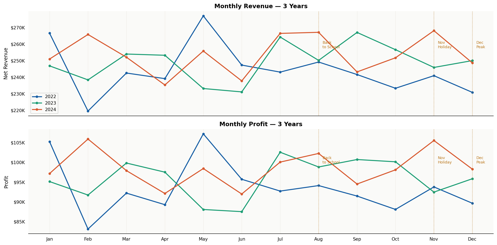
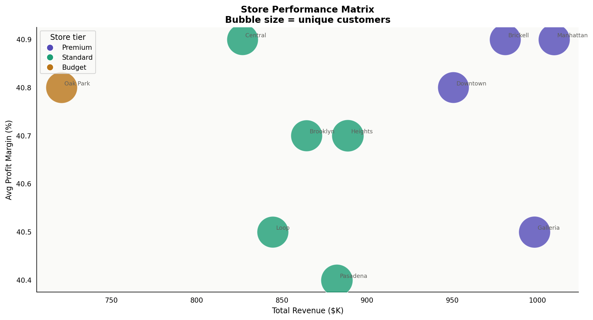
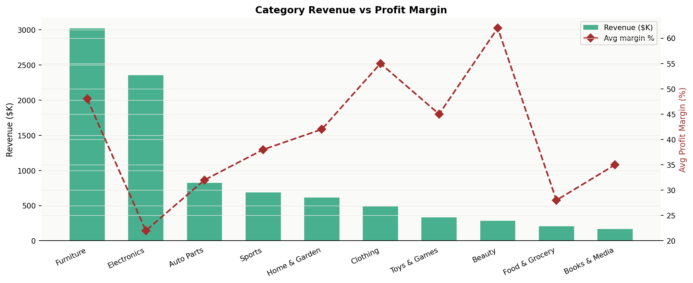
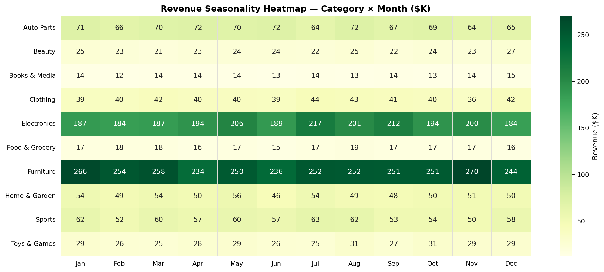
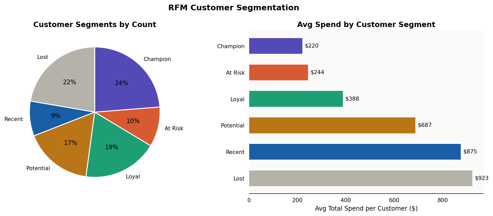
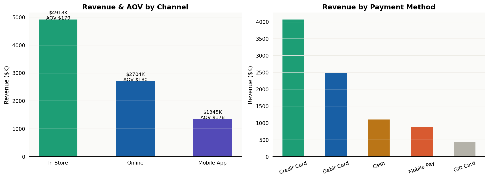
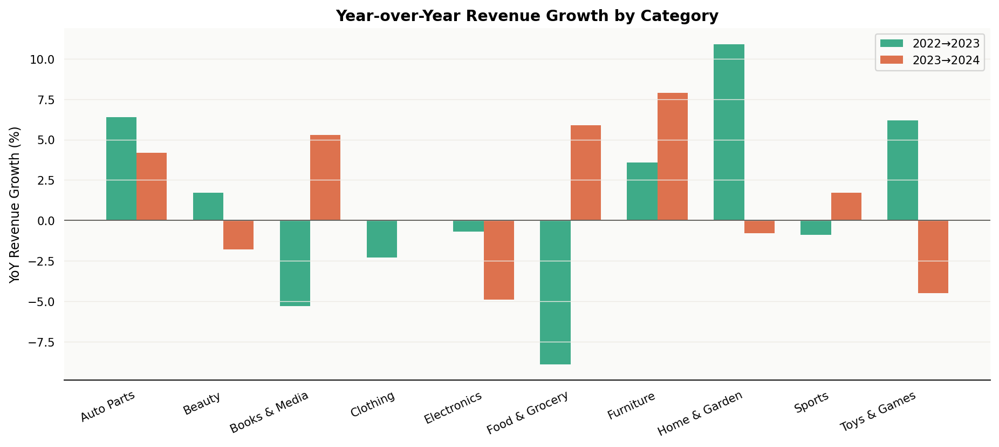

# 🛍️ Retail Sales EDA — 3 Years of Transactions

> *End-to-end exploratory data analysis of 50,000 retail transactions across 10 stores, 3 years, and 10 product categories. Covers seasonality, store performance, customer RFM segmentation, channel analysis, and YoY growth.*


---

## Overview

This project simulates a multi-store retail chain with locations across 6 US regions. The dataset mirrors real retail patterns including holiday spikes, seasonal category trends, weekend lifts, and loyalty tier effects. The analysis answers the questions every retail business cares about:

- Which stores, categories, and products drive the most revenue and profit?
- How does revenue change across months, quarters, and years?
- Are we growing? Where are we declining?
- Who are our best customers — and which ones are about to leave?
- Do discounts help or hurt profitability?

---

## Key Results

| Metric | Value |
|---|---|
| Total transactions | 50,000 |
| Total net revenue | $8.97M |
| Total profit | $3.46M |
| Avg profit margin | 40.71% |
| Avg order value | $179.34 |
| Return rate | 7.62% |
| Unique customers | 16,428 |
| Stores analyzed | 10 across 6 regions |

---

## Project Structure

```
retail-sales-analysis/
├── sql/
│   ├── schema/01_create_tables.sql     # Normalized schema + indexes
│   ├── views/02_create_views.sql       # 3 reusable analytical views
│   └── analysis/03_retail_analysis.sql # 10 analytical queries
├── src/
│   ├── data_generator.py               # Realistic retail data simulation
│   └── charts.py                       # 7 publication-quality charts
├── data/
│   ├── raw/                            # CSV exports of all tables
│   └── retail_sales.db                 # SQLite database
├── outputs/
│   ├── charts/                         # 7 PNG visualizations
│   └── excel/retail_sales_analysis.xlsx # 8-sheet workbook
├── run_analysis.py                     # End-to-end pipeline
└── requirements.txt
```

---

## SQL Highlights

### YoY Revenue Growth (Window Function + LAG)
```sql
WITH yearly AS (
    SELECT year, ROUND(SUM(net_revenue), 2) AS revenue
    FROM transactions GROUP BY year
)
SELECT year, revenue,
    ROUND(100.0 * (revenue - LAG(revenue) OVER (ORDER BY year))
          / LAG(revenue) OVER (ORDER BY year), 1) AS yoy_growth_pct
FROM yearly;
```

### RFM Customer Segmentation (NTILE + CASE)
```sql
SELECT customer_id,
    NTILE(5) OVER (ORDER BY recency_days ASC)  AS r_score,
    NTILE(5) OVER (ORDER BY frequency DESC)    AS f_score,
    NTILE(5) OVER (ORDER BY monetary DESC)     AS m_score,
    CASE
        WHEN r >= 4 AND f >= 4 THEN 'Champion'
        WHEN r >= 3 AND f >= 3 THEN 'Loyal'
        WHEN r <= 2 AND f >= 4 THEN 'At Risk'
        WHEN r <= 2 AND f <= 2 THEN 'Lost'
    END AS segment
FROM rfm_scored;
```

### 3-Month Rolling Revenue Average
```sql
ROUND(AVG(revenue) OVER (
    ORDER BY year, month
    ROWS BETWEEN 2 PRECEDING AND CURRENT ROW
), 2) AS rolling_3m_avg
```

---

## Excel Workbook — 8 Sheets

| Sheet | Content |
|---|---|
| Executive Summary | YoY KPIs per year |
| Monthly Revenue | 36 months of metrics |
| Store KPIs | 9 metrics per store |
| Category Performance | Revenue, margin, returns by category & year |
| Top 20 Products | Best sellers by revenue |
| Channel Analysis | In-Store vs Online vs Mobile App |
| RFM Segments | Customer segment breakdown |
| Discount Impact | Revenue and margin by discount band |

---

## Charts

### Fig 1 — Monthly Revenue & Profit (3 Years)


### Fig 2 — Store Performance Matrix


### Fig 3 — Category Revenue vs Margin


### Fig 4 — Seasonality Heatmap


### Fig 5 — RFM Customer Segments


### Fig 6 — Channel & Payment Analysis


### Fig 7 — YoY Growth by Category


---

## Quickstart

```bash
git clone https://github.com/Divyadhole/retail-sales-analysis.git
cd retail-sales-analysis
pip install -r requirements.txt
python run_analysis.py
```

---

## Skills Demonstrated

| Area | Detail |
|---|---|
| SQL | CTEs, LAG(), NTILE(), rolling averages, conditional aggregation, views |
| Python | pandas, matplotlib, seaborn, sqlite3, modular src/ architecture |
| Analytics | RFM segmentation, seasonality analysis, YoY growth, discount impact |
| Excel | 8-sheet auto-formatted workbook |
| Business | Retail KPIs — AOV, return rate, margin, channel mix |

---

*Junior Data Analyst Portfolio — Project 4 of 40*
